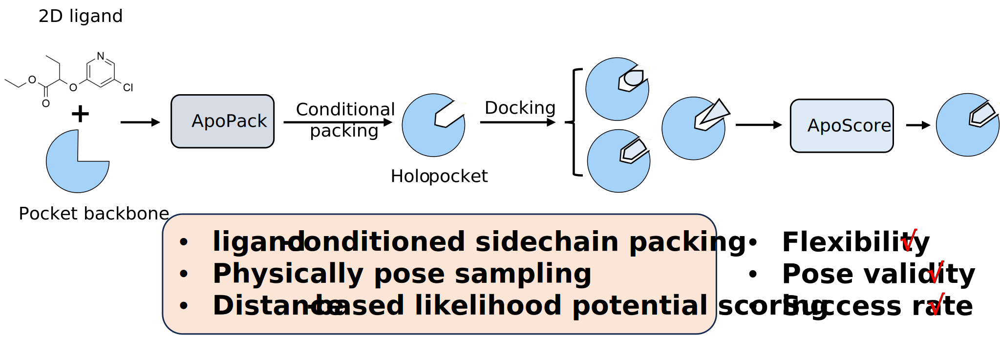

[](https://github.com/ld139/ApoDock_public)
[](https://doi.org/10.1101/2024.11.22.624942)


# ApoDock
<div align=center>

</div> 


ApoDock is a modular docking paradigm that combines machine learning-driven conditional side-chain packing based on protein backbone and ligand information with traditional sampling methods to ensure physically realistic poses.

To run ApoDock, clone this GitHub repository and install Python.

## Requirements

-  Operating System: Linux (Recommended)

## Install Dependencies
```
conda env create -f environment.yaml
conda activate apodock

```

## Quick start

First, you need to download the binary sampling software [Gnina](https://github.com/gnina/gnina/releases/download/v1.1/gnina) or [Smina](https://sourceforge.net/projects/smina/) to `docking_program` dir, then give execution permission:
```
chmod +x Gnina
chmod +x Smina.static
```
Then set the enviroment path:
```
export PATH="$PATH:/your/path/to/ApoDock_public/docking_program"
```

## Configuration-based Approach

ApoDock now uses a YAML configuration file for all settings. This provides a centralized, flexible way to configure the docking pipeline.

### Basic Configuration

Create a configuration file (e.g., `config.yaml`):

```yaml
# General pipeline settings
output_dir: ./docking_results
use_packing: true
top_k: 40
pocket_distance: 10.0
random_seed: 42

# Input file settings
input:
  protein_file: ./demo/1a0q/1a0q_protein.pdb
  ligand_file: ./demo/1a0q/1a0q_ligand.sdf
  ref_lig_file: ./demo/1a0q/1a0q_ligand.sdf

# Docking engine settings
docking:
  program: gnina
  gnina_path: /path/to/gnina
```

### Running ApoDock

Run ApoDock with your configuration file:

```bash
python -m apodock.docking --config config.yaml
```

To view the loaded configuration without running the pipeline:

```bash
python -m apodock.docking --config config.yaml --show_config
```

### Pocket Screening Mode

For pocket design screening, create a configuration with screening options:

```yaml
# General settings
output_dir: ./screening_results
use_packing: true

# Screening options
screening_mode: true
output_scores_file: pocket_scores.csv
save_poses: false
rank_by: aposcore  # Options: aposcore, gnina_affinity, gnina_cnn_score, gnina_cnn_affinity

# Input files
input:
  protein_file: ./demo/1a0q/1a0q_protein.pdb
  ligand_file: ./demo/1a0q/1a0q_ligand.sdf
  ref_lig_file: ./demo/1a0q/1a0q_ligand.sdf
```

### Multiple Configuration Files

Create different configuration files for different use cases:

- `standard_docking.yaml` - For standard docking with pose generation
- `screening_aposcore.yaml` - For pocket screening with ApoScore ranking
- `screening_gnina.yaml` - For pocket screening with GNINA score ranking

## Output

Results will be saved to the directory specified in the configuration file (`output_dir`). In screening mode, a CSV file with ranking information will be generated.

## Advanced Configuration

See the sample configuration file in `apodock/configs/config.yaml` for all available options and their descriptions.

## Acknowledgements
This work draws upon code from [ProteinMPNN](https://github.com/dauparas/ProteinMPNN), [OpenFold](https://github.com/aqlaboratory/openfold), [RTMscore](https://github.com/sc8668/RTMScore), and [PIPPack](https://github.com/Kuhlman-Lab/PIPPack), and we would like to thank them for their excellent contributions. these studies are important and interesting.

